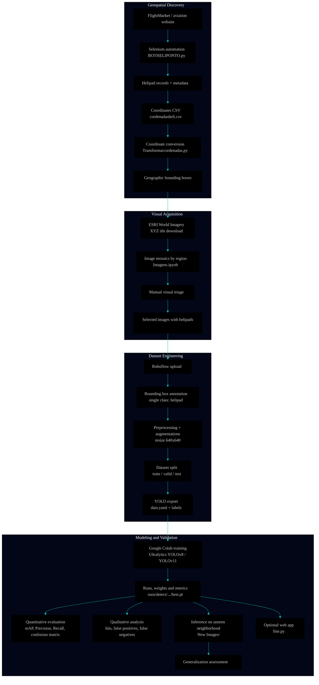

 

\[[🇧🇷 Português](README.pt_BR.md)\] \[**[🇺🇸 English](README.md)**\]

  

# 
🧠 AI/ML Project 2 · Computer Vision · Helipoint Detector

### 
Automated Helipad Detection Using YOLO and Satellite Imagery of São Paulo, Brazil

 

<a href="https://github.com/topics/satellite-imagery">Satellite Imagery</a>
&nbsp;&nbsp;✦&nbsp;&nbsp;
<a href="https://github.com/topics/data-visualization">Urban Analytics</a>
&nbsp;&nbsp;✦&nbsp;&nbsp;
<a href="https://github.com/topics/object-detection">Object Detection</a>
&nbsp;&nbsp;✦&nbsp;&nbsp;
<a href="https://github.com/topics/yolo">YOLO (v8 / v11)</a>
&nbsp;&nbsp;✦&nbsp;&nbsp;
<a href="https://github.com/topics/geospatial">Geospatial Intelligence</a>

  

#### 
✨ <i>Teaching YOLO to spot the city's most exclusive landing spots.</i> ✨

<i>Finding hidden H’s in the concrete jungle</i>  
<b>One rooftop at a time.</b> 🚁⚡️

 

#

  
<!-- ========= END REPO TITLE ========= -->

<!-- ========= START SPONSOR BADGE ========= -->
#### 
 

  
<!-- ========= END SPONSOR BADGE ========= -->

<!-- ========= START GIFE ========= -->

   
 

   
<!-- ========= END GIFR IMAGE ========= -->

<!-- ======================================= Start Institutional INFO ===========================================  -->
## [Institutional Information]()

[**Institution:**]() Pontifical Catholic University of São Paulo (PUC‑SP) — FACEI  
[**Course:**]() BSc in Humanistic AI & Data Science — 5th semester — 2026  
[**Subject:**]() Machine Learning / Computer Vision — YOLO  
[**Project:**]() P2 — Object Detection in Satellite Images with YOLO  

**Professor:** [✨ Rooney Ribeiro Albuquerque Coelho](https://www.linkedin.com/in/rooney-coelho-320857182/)  
**Authors:**  
[Carlos Antonio Roth Gorham]()   • [Fabiana ⚡️ Campanari](https://linktr.ee/fabianacampanari)   •  [Pedro Vyctor Almeida](https://www.linkedin.com/in/pedro-vyctor-almeida-285b89273/) 

  

#

  
<!-- ========= END Institutional INFO ========= -->

<!-- ========= START Streamlit BADGE ========= -->

  

<!-- ========= END Streamlit BADGE========= -->

<!-- ========= START React Presentation BADGE ========= -->

  
  
<!-- =========End Eeact Presentation BADGE ========= -->

<!-- ========= START Data Analysis Report BADGE ========= -->
  

  

#

  

<!-- ========= START TECH STACK / PIPELINE BADGES ========= -->

  
  
  

  
  
  

  
  

  

#

  
<!-- =========END TECH STACK / PIPELINE BADGES========= -->

<!-- ========= START NOTE ========= -->
> [!WARNING]
>
> ⚠️ Projects may be publicly shared when permitted.  
> The focus is on applied, hands-on learning with real datasets in AI governance and security contexts.  
> All sensitive content remains protected in private repositories when required.
>

  
<!-- ========= END NOTE ========= -->

<!-- =========START MAIN REPO =Projects REFERENCES ========= -->
> [!TIP]
>
> This repository is part of the flagship ecosystem:
>
> ## 🧠 AI & Machine Learning — Main Hub
>
> Explore the complete collection of projects, notebooks, research materials, analyses, and interactive applications available in the central repository:
>
> 🔗 **[AI & Machine Learning — Hub](https://github.com/Mindful-AI-Assistants/1-AI_Machine-Learning_Hub)**
>
> #
>
> ###  Related Project in this Series
>
> 🔗 **[AI/ML Project 1 · Computer Vision · EMNIST Vision Intelligence](https://github.com/Mindful-AI-Assistants/2-project-ai-ml-emnist-vision-intelligence)**
>
> A deep learning system for handwritten character recognition using PyTorch and Streamlit.
>
> #
>
> ✨ Part of the *Humanistic AI & Machine Learning Series*
>
> *From handwriting to rooftops — simplicity was never in the roadmap.* ⚡️

  
<!-- =========ENDMAIN REPO =Projects REFERENCES ========= -->

  
  
  
  
  
  

## [MLOps Pipeline Architecture]()

  
  
  
  
  
  

