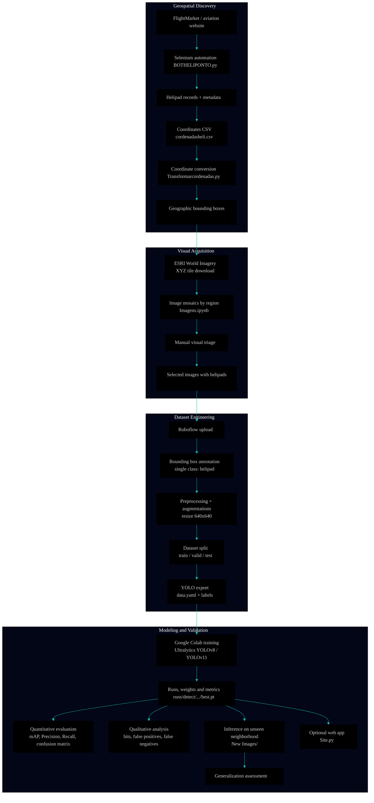

 

\[[🇧🇷 Português](README.pt_BR.md)\] \[**[🇺🇸 English](README.md)**\]

  

#  
 3- 🧠 [AI /ML - Project 2]() /  [Computer Vision]() - [Helipoint Detector]()

### 
 Automated Helipad Detection Using YOLO and Satellite Imagery of São Paulo, Brazil

 

<a href="https://github.com/topics/satellite-imagery">Satellite Imagery</a> &nbsp;&nbsp;✦&nbsp;&nbsp;
<a href="https://github.com/topics/data-visualization">Urban Analytics</a> &nbsp;&nbsp;✦&nbsp;&nbsp;
<a href="https://github.com/topics/object-detection">Object Detection</a> &nbsp;&nbsp;✦&nbsp;&nbsp;
<a href="https://github.com/topics/yolo">YOLOv8 / YOLOv11</a> &nbsp;&nbsp;✦&nbsp;&nbsp;
<a href="https://github.com/topics/geospatial">Geospatial Intelligence</a>

 

#### 
 ✨ ***From Pixels to Geospatial Intelligence*** ✨

<!--
#### 
 Teaching YOLO to say: ***“Yup  !!! that's definitely an H !!*** 
##### 
 ***Finding Hidden H's in the Concrete Jungle...*** ⚡️ One Rooftop at a Time.
-->

  

#

  
<!-- ========= END REPO TITLE ========= -->

<!-- ========= START SPONSOR BADGE ========= -->
#### 
 

  
<!-- ========= END SPONSOR BADGE ========= -->

<!-- ========= START GIFE ========= -->

   
 

   
<!-- ========= END GIFR IMAGE ========= -->

<!-- ======================================= Start Institutional INFO ===========================================  -->
[**Institution:**]() Pontifical Catholic University of São Paulo (PUC-SP) • Humanistic AI & Data Science • 2026  
[**School:**]() Faculty of Interdisciplinary Studies   
[**Course Repo:**]() Integrated Project — Machine Learning   
**Project:**  P2 — Object Detection in Satellite Images with YOLO   
**Professor:**  [✨ Rooney Ribeiro Albuquerque Coelho](https://www.linkedin.com/in/rooney-coelho-320857182/)   
**Authors:**  [Fabiana ⚡️ Campanari](https://linktr.ee/fabianacampanari) and Pedro Vyctor Almeida      

  

#

  
<!-- ========= END Institutional INFO ========= -->

<!-- ========= START Streamlit BADGE ========= -->

  

<!-- ========= END Streamlit BADGE========= -->

<!-- ========= START React Presentation BADGE ========= -->

  
  
<!-- =========End Eeact Presentation BADGE ========= -->

<!-- ========= START Data Analysis Report BADGE ========= -->
  

  

#

  

<!-- ========= START BADGES GROUP 2 ========= -->

  

  
  

  
  
  

   
<!-- ========= END BADGES GROUP 2========= -->

<!-- ========= START NOTE ========= -->
> [!WARNING]
>
> ⚠️ Projects may be publicly shared when permitted.  
> The focus is on applied, hands-on learning with real datasets in AI governance and security contexts.  
> All sensitive content remains protected in private repositories when required.
>

  
<!-- ========= END NOTE ========= -->

  
  
  
  
  
  

## [MLOps Pipeline Architecture]()

  
  
  
  
  
  

