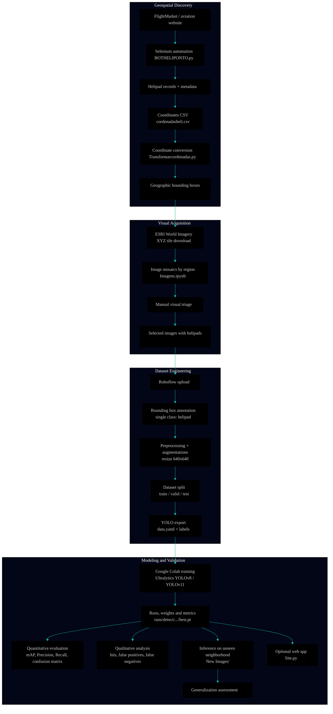

## [Mermaid Pipeline ajustado]()

```mermaid
%%{
  init: {
    "theme": "dark",
    "themeVariables": {
      "background": "#0b1220",
      "primaryColor": "#000000",
      "primaryTextColor": "#ffffff",
      "primaryBorderColor": "#000000",
      "lineColor": "#14b8a6",
      "secondaryColor": "#000000",
      "secondaryTextColor": "#ffffff",
      "secondaryBorderColor": "#000000",
      "tertiaryColor": "#000000",
      "tertiaryTextColor": "#ffffff",
      "tertiaryBorderColor": "#000000",
      "mainBkg": "#000000",
      "nodeBorder": "#000000",
      "clusterBkg": "#020617",
      "clusterBorder": "#000000",
      "titleColor": "#ffffff",
      "edgeLabelBackground": "#0b1220",
      "fontFamily": "Inter, Segoe UI, Arial, sans-serif"
    }
  }
}%%

flowchart TD

    A["FlightMarket / aviation website"] --> B["Selenium automation<br/>BOTHELIPONTO.py"]
    B --> C["Helipad records + metadata"]
    C --> D["Coordinates CSV<br/>cordenadasheli.csv"]
    D --> E["Coordinate conversion<br/>Transformarcordenadas.py"]
    E --> F["Geographic bounding boxes"]
    F --> G["ESRI World Imagery<br/>XYZ tile download"]
    G --> H["Image mosaics by region<br/>Imagens.ipynb"]
    H --> I["Manual visual triage"]
    I --> J["Selected images with helipads"]
    J --> K["Roboflow upload"]
    K --> L["Bounding box annotation<br/>single class: helipad"]
    L --> M["Preprocessing + augmentations<br/>resize 640x640"]
    M --> N["Dataset split<br/>train / valid / test"]
    N --> O["YOLO export<br/>data.yaml + labels"]
    O --> P["Google Colab training<br/>Ultralytics YOLOv8 / YOLOv11"]
    P --> Q["Runs, weights and metrics<br/>runs/detect/.../best.pt"]
    Q --> R["Quantitative evaluation<br/>mAP, Precision, Recall, confusion matrix"]
    Q --> S["Qualitative analysis<br/>hits, false positives, false negatives"]
    Q --> T["Inference on unseen neighborhood<br/>New Images/"]
    T --> U["Generalization assessment"]
    Q --> V["Optional web app<br/>Site.py"]

    subgraph G1["Geospatial Discovery"]
      A
      B
      C
      D
      E
      F
    end

    subgraph G2["Visual Acquisition"]
      G
      H
      I
      J
    end

    subgraph G3["Dataset Engineering"]
      K
      L
      M
      N
      O
    end

    subgraph G4["Modeling and Validation"]
      P
      Q
      R
      S
      T
      U
      V
    end
```
